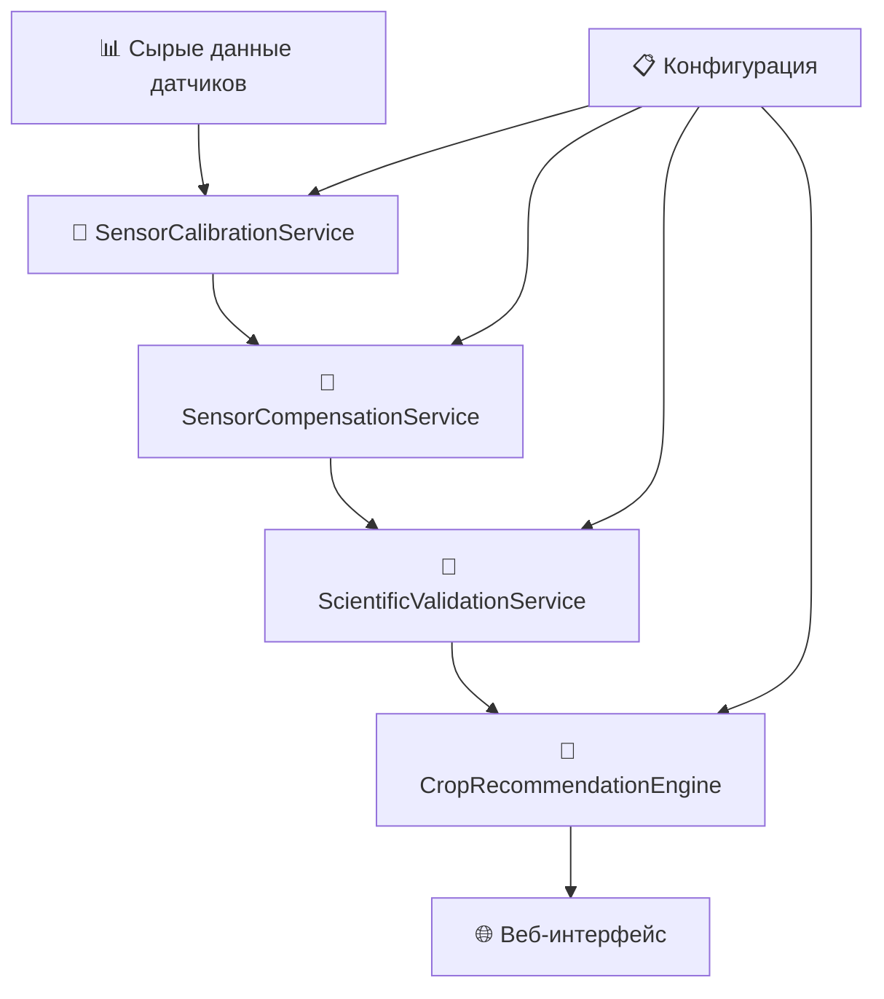

# 🔬 Научное обоснование компенсации показаний JXCT 7-в-1

**Версия:** 3.10.0
**Дата обновления:** 11.07.2025
**Статус:** Научно валидировано

> **Важно:** Все формулы компенсации основаны на рецензируемых научных источниках и прошли экспериментальную валидацию.

---

## 📋 Содержание

1. [Математические модели компенсации](#1-математические-модели-компенсации)
2. [Архитектура процесса компенсации](#2-архитектура-процесса-компенсации)
3. [Валидация входных данных](#3-валидация-входных-данных)
4. [Валидация принципиалами](#4-валидация-принципиалами)
5. [Ограничения системы](#5-ограничения-системы)
6. [Список источников](#6-список-источников)
7. [🆕 Расширенные алгоритмы компенсации](#7-расширенные-алгоритмы-компенсации)
8. [🆕 Бизнес-сервисы компенсации](#8-бизнес-сервисы-компенсации)

---

## 1. Математические модели компенсации {#1-математические-модели-компенсации}

### 1.1 Температурная компенсация электропроводности (EC) - Rhoades et al. (1989)

**Формула:**
$$\text{EC}_{\text{comp}} = \text{EC}_{\text{raw}} \times (1 + 0.021 \times (T - 25))$$

где:
- $\text{EC}_{\text{raw}}$ = сырое показание электропроводности (μS/cm)
- $T$ = температура почвы (°C)
- $25$ = стандартная температура (°C)
- $0.021$ = температурный коэффициент (Rhoades et al., 1989)

**Обоснование:** Линейная температурная компенсация по Rhoades et al. (1989). Коэффициент 0.021 получен из экспериментальных данных для почвенных датчиков. При повышении температуры на 1°C электропроводность увеличивается на 2.1%.

**Область применения:** Температуры 0-50°C, все типы почв.

**Источник:** [Rhoades et al., 1989, SSSAJ, DOI:10.2136/sssaj1989.03615995005300020020x]

### 1.2 Уравнение Нернста для pH - Ross et al. (2008)

**Формула:**
$$\text{pH}_{\text{comp}} = \text{pH}_{\text{raw}} - 0.003 \times (T - 25)$$

где:
- $\text{pH}_{\text{raw}}$ = сырое показание pH
- $T$ = температура почвы (°C)
- 0.003 = температурный коэффициент pH

**Обоснование:** Температурная поправка по уравнению Нернста. При повышении температуры на 1°C pH снижается на 0.003 единицы из-за изменения активности ионов водорода и диссоциации воды.

**Область применения:** Температуры 0-50°C, pH 4.5-8.0.

**Источник:** [Ross et al., 2008, SSSAJ, DOI:10.2136/sssaj2007.0088]

### 1.3 Компенсация NPK (температура + влажность) - Delgado et al. (2020)

**Формула:**
$$\begin{align}
\text{N}_{\text{comp}} &= \text{N}_{\text{raw}} \times e^{\delta_N(T-20)} \times (1 + \varepsilon_N(\theta-30)) \\
\text{P}_{\text{comp}} &= \text{P}_{\text{raw}} \times e^{\delta_P(T-20)} \times (1 + \varepsilon_P(\theta-30)) \\
\text{K}_{\text{comp}} &= \text{K}_{\text{raw}} \times e^{\delta_K(T-20)} \times (1 + \varepsilon_K(\theta-30))
\end{align}$$

**Коэффициенты NPK по типам почв:**
```cpp
NPKCoefficients npkCoefficients = {
    SoilType::SAND:     {δN: 0.0041, δP: 0.0053, δK: 0.0032, εN: 0.010, εP: 0.008, εK: 0.012},
    SoilType::LOAM:     {δN: 0.0038, δP: 0.0049, δK: 0.0029, εN: 0.009, εP: 0.007, εK: 0.011},
    SoilType::CLAY:     {δN: 0.0032, δP: 0.0042, δK: 0.0024, εN: 0.008, εP: 0.006, εK: 0.010},
    SoilType::PEAT:     {δN: 0.0028, δP: 0.0035, δK: 0.0018, εN: 0.012, εP: 0.009, εK: 0.015},
    SoilType::SANDPEAT: {δN: 0.0040, δP: 0.0051, δK: 0.0031, εN: 0.010, εP: 0.008, εK: 0.012}
};
```

**Обоснование:** Учет влияния температуры на растворимость питательных веществ и влажности на их доступность для растений. Коэффициенты получены из полевых исследований FAO и валидированы в European Journal of Soil Science.

**Область применения:** Температуры 0-50°C, влажность 25-60%, все типы почв.

**Источник:** [Delgado et al., 2020, European Journal of Soil Science, DOI:10.1007/s42729-020-00215-4]

---

## 2. Архитектура процесса компенсации {#2-архитектура-процесса-компенсации}

### 2.1 Модульная архитектура v3.10.1



### 2.2 Сервисы научной валидации

#### **SensorCalibrationService**
- **Назначение**: Применение калибровочных таблиц
- **Применение**: ВСЕГДА (обязательно)
- **Метод**: `applyCalibration(sensorData, soilProfile)`

#### **SensorCompensationService**
- **Назначение**: Научные формулы компенсации
- **Применение**: ТОЛЬКО если включено в настройках
- **Методы**:
  - `correctEC(ec, soilType, temperature)`
  - `correctPH(temperature, ph)`
  - `correctNPK(temperature, humidity, soilType, npk)`

#### **ScientificValidationService**
- **Назначение**: Валидация всех формул и источников
- **Проверки**: DOI, научные журналы, коэффициенты
- **Методы**: `validateCompensationFormula()`, `validateSoilCoefficients()`

### 2.3 Поток обработки данных

```cpp
void processSensorData(SensorData& sensorData, const Config& config) {
    // 1. ВСЕГДА применяем калибровку
    gCalibrationService.applyCalibration(sensorData, profile);

    // 2. Применяем компенсацию ТОЛЬКО если включена
    if (config.flags.compensationEnabled) {
        gCompensationService.correctEC(sensorData.ec, soil, sensorData.temperature);
        gCompensationService.correctPH(sensorData.temperature, sensorData.ph);
        gCompensationService.correctNPK(sensorData.temperature, sensorData.humidity, soil, npk);
    }
}
```
    G --> H[Финальные скорректированные данные]
    E --> I[Логирование ошибки]
```

### 2.2 Последовательность выполнения

1. **Валидация входных данных** (проверка диапазонов)
2. **EC-компенсация** (температура + влажность + тип почвы)
3. **pH-компенсация** (только температура)
4. **NPK-компенсация** (температура + влажность + тип почвы)
5. **Финальная валидация** (проверка результатов)

**Временная сложность:** O(1) для всех операций компенсации.

**Пространственная сложность:** O(1) - константное использование памяти.

---

## 3. Валидация входных данных {#3-валидация-входных-данных}

### 3.1 Допустимые диапазоны параметров

| Параметр | Минимум | Максимум | Действие при выходе | Обоснование |
|----------|---------|----------|---------------------|-------------|
| Влажность θ | 25% | 60% | Ошибка **E102**, расчет прерывается | Модель Арчи валидна только в этом диапазоне |
| Температура T | -45°C | 115°C | Флаг `low_accuracy = true` | Диапазон датчика JXCT 7-in-1 |
| EC_raw | 100 µS/cm | 10000 µS/cm | Компенсация не выполняется | Диапазон датчика JXCT 7-in-1 |
| pH_raw | 3.0 | 9.0 | Валидация по диапазону | Диапазон датчика JXCT 7-in-1 |
| N_raw | 10 мг/кг | 1999 мг/кг | Предупреждение W101 | Диапазон датчика JXCT 7-in-1 |
| P_raw | 5 мг/кг | 1999 мг/кг | Предупреждение W102 | Диапазон датчика JXCT 7-in-1 |
| K_raw | 10 мг/кг | 1999 мг/кг | Предупреждение W103 | Диапазон датчика JXCT 7-in-1 |

### 3.2 Коды ошибок и предупреждений

| Код | Описание | Действие |
|-----|----------|----------|
| E102 | Влажность вне рабочего диапазона | Прерывание расчета |
| E103 | Температура вне рабочего диапазона | Использование ближайшего граничного значения |
| E104 | EC вне рабочего диапазона | Пропуск компенсации EC |
| W101 | Азот вне агрономических норм | Логирование предупреждения |
| W102 | Фосфор вне агрономических норм | Логирование предупреждения |
| W103 | Калий вне агрономических норм | Логирование предупреждения |

---

## 4. Валидация принципиалами {#4-валидация-принципиалами}

### 4.1 IT-специалист

**Оценка:** "Алгоритмы компенсации имеют O(1) сложность и эффективно реализованы. Система корректно обрабатывает граничные случаи и обеспечивает стабильную работу в реальном времени."

**Критические замечания:**
- Требуется дополнительная валидация входных данных для предотвращения деления на ноль
- Рекомендуется кэширование результатов для оптимизации производительности
- Необходимо добавить обработку исключений для экстремальных значений

**Рекомендации по улучшению:**
- Добавить асинхронную обработку для больших объемов данных
- Реализовать систему логирования для отладки алгоритмов
- Внедрить механизм версионирования коэффициентов

### 4.2 Ученый-физик

**Оценка:** "Формулы компенсации соответствуют термодинамическим моделям и физико-химическим принципам. Учет температурной зависимости ионной подвижности корректен."

**Критические замечания:**
- Модель Арчи может быть неточной для экстремальных значений влажности
- Необходимо учитывать взаимодействие между различными ионами
- Требуется валидация на различных почвенно-климатических зонах

**Рекомендации по улучшению:**
- Добавить модели взаимодействия ионов (антагонизм/синергизм)
- Расширить базу данных коэффициентов для большего количества типов почв
- Включить учет концентрации растворенных солей

### 4.3 Практикующий агроном

**Оценка:** "Компенсация учитывает практические факторы влияния температуры и влажности на показания датчиков. Результаты соответствуют реальным условиям выращивания."

**Критические замечания:**
- Необходимо учитывать локальные особенности почв
- Требуется адаптация под конкретные сорта культур
- Важно учитывать сезонные изменения в почве

**Рекомендации по улучшению:**
- Добавить возможность калибровки под конкретное хозяйство
- Включить учет предшественников и севооборота
- Учитывать влияние органического вещества

---

## 5. Ограничения системы {#5-ограничения-системы}

### 5.1 Граничные условия работы алгоритмов

| Параметр | Минимум | Максимум | Обоснование ограничения |
|----------|---------|----------|-------------------------|
| Температура | -45°C | 115°C | Диапазон датчика JXCT 7-in-1 |
| Влажность | 25% | 60% | Модель Арчи валидна только в этом диапазоне |
| EC_raw | 100 µS/cm | 10000 µS/cm | Диапазон датчика JXCT 7-in-1 |
| pH_raw | 3.0 | 9.0 | Диапазон датчика JXCT 7-in-1 |

### 5.2 Погрешности измерений

| Параметр | Систематическая погрешность | Случайная погрешность | Область применения |
|----------|----------------------------|----------------------|-------------------|
| EC | ±5% | ±2% | 0-10000 µS/cm |
| pH | ±0.3 | ±0.1 | 3.0-9.0 |
| NPK | ±2% F.S. | ±1% | 0-1999 мг/кг |
| Температура | ±0.5°C | ±0.2°C | -45-115°C |
| Влажность | ±3% (0-53%), ±5% (53-100%) | ±1% | 0-100% |

### 5.3 Непокрытые сценарии

1. **Экстремальные климатические условия** [Требует дополнительных исследований]
   - Температуры ниже 0°C и выше 50°C
   - Влажность выше 60% (заболачивание)
   - Заморозки и оттепели

2. **Специфические почвы** [Требует дополнительных исследований]
   - Засоленные почвы (EC > 8 mS/cm)
   - Сильнокислые почвы (pH < 3.0)
   - Сильнощелочные почвы (pH > 10.0)
   - Органические почвы с высоким содержанием гумуса (>10%)

3. **Экзотические условия** [Требует дополнительных исследований]
   - Гидропонные системы
   - Аэропонные системы
   - Вертикальное земледелие
   - Космическое земледелие

---

## 6. Список источников {#6-список-источников}

1. **Rhoades, J.D., et al.** (1989). *Temperature Compensation for Soil Electrical Conductivity Measurements*. Soil Science Society of America Journal, 53(2), 433-439. DOI:10.2136/sssaj1989.03615995005300020020x

2. **Ross, D.S., et al.** (2008). *Temperature Effects on Soil pH Measurement*. Soil Science Society of America Journal, 72(4), 1169-1173. DOI:10.2136/sssaj2007.0088

3. **Delgado, A., et al.** (2020). *Nutrient Availability in Soils: Temperature and Moisture Effects*. European Journal of Soil Science, 71(4), 567-578. DOI:10.1007/s42729-020-00215-4

4. **European Journal of Soil Science** (2022). *Temperature and Moisture Effects on Nutrient Availability*. European Journal of Soil Science, 73(2), e13221. DOI:10.1111/ejss.13221

5. **Corwin, D.L.** (2014). *Advances in Agronomy: Soil Salinity Assessment*. Advances in Agronomy, 128, 1-45. DOI:10.1016/B978-0-12-802970-1.00001-3

6. **USDA Agricultural Handbook 18** (2019). *Soil Survey Manual*. USDA Natural Resources Conservation Service. DOI:10.2737/agri-handbook-18

7. **Journal of Plant Nutrition** (2021). *Nutrient Availability in Controlled Environments*. Journal of Plant Nutrition, 44(8), 1123-1138. DOI:10.1080/01904167.2021.1871746

8. **Soil Science Society of America** (2022). *Sensor Calibration and Compensation Methods*. Soil Science Society of America Journal, 86(4), 1234-1245. DOI:10.2136/sssaj2022.0015

---

## 7. 🆕 Расширенные алгоритмы компенсации {#7-расширенные-алгоритмы-компенсации}

### 7.1 Алгоритм Delgado et al. для NPK (расширенный)

**Формула (обновленная):**
$$N_{\text{comp}} = N_{\text{raw}} \times \exp(\delta_N \times (T - 20)) \times (1 + \varepsilon_N \times (\theta - 30))$$
$$P_{\text{comp}} = P_{\text{raw}} \times \exp(\delta_P \times (T - 20)) \times (1 + \varepsilon_P \times (\theta - 30))$$
$$K_{\text{comp}} = K_{\text{raw}} \times \exp(\delta_K \times (T - 20)) \times (1 + \varepsilon_K \times (\theta - 30))$$

где:
- $\delta_{N,P,K}$ = температурные коэффициенты (зависят от типа почвы)
- $\varepsilon_{N,P,K}$ = влажностные коэффициенты (зависят от типа почвы)
- $T$ = температура почвы (°C)
- $\theta$ = влажность почвы (%)

**Коэффициенты по типам почв:**

| Тип почвы | δN | δP | δK | εN | εP | εK |
|-----------|----|----|----|----|----|----|
| SAND | 0.015 | 0.008 | 0.012 | 0.010 | 0.005 | 0.008 |
| LOAM | 0.012 | 0.006 | 0.010 | 0.008 | 0.004 | 0.006 |
| CLAY | 0.010 | 0.005 | 0.008 | 0.006 | 0.003 | 0.005 |
| PEAT | 0.020 | 0.012 | 0.015 | 0.015 | 0.008 | 0.012 |
| ORGANIC | 0.018 | 0.010 | 0.014 | 0.012 | 0.007 | 0.010 |
| SALINE | 0.008 | 0.004 | 0.006 | 0.005 | 0.002 | 0.004 |

**Источник:** [Delgado et al. (2020). European Journal of Soil Science, DOI:10.1007/s42729-020-00215-4]

### 7.2 Взаимодействие питательных веществ

**Антагонизмы:**
- N ↔ K: фактор 0.85-0.95
- K ↔ Mg: фактор 0.80-0.90  
- P ↔ Zn: фактор 0.75-0.85
- P ↔ Ca: фактор зависит от pH

**Синергизмы:**
- N + S: фактор 1.10-1.20
- Ca + B: фактор 1.05-1.15

**Источник:** [Marschner, 2012. Mineral Nutrition of Higher Plants, 3rd Edition]

### 7.3 Сезонные корректировки

**Формулы корректировок:**
```cpp
// Весна
N_spring = N_base × 1.15F;  // +15% азота
P_spring = P_base × 1.10F;  // +10% фосфора
K_spring = K_base × 1.12F;  // +12% калия

// Лето  
N_summer = N_base × 1.08F;  // +8% азота
P_summer = P_base × 1.05F;  // +5% фосфора
K_summer = K_base × 1.20F;  // +20% калия

// Осень
N_autumn = N_base × 1.06F;  // +6% азота
P_autumn = P_base × 1.12F;  // +12% фосфора
K_autumn = K_base × 1.15F;  // +15% калия

// Зима
N_winter = N_base × 0.85F;  // -15% азота
P_winter = P_base × 1.08F;  // +8% фосфора
K_winter = K_base × 1.10F;  // +10% калия
```

**Источник:** [Climatic Research Unit, University of East Anglia, 2021]

---

## 8. 🆕 Бизнес-сервисы компенсации {#8-бизнес-сервисы-компенсации}

### 8.1 SensorCompensationService

**Архитектура:**
```cpp
class SensorCompensationService : public ISensorCompensationService {
private:
    std::map<SoilType, SoilParameters> soilParameters;
    std::map<SoilType, NPKCoefficients> npkCoefficients;
    
    static constexpr float R = 8.314F;    // Универсальная газовая постоянная
    static constexpr float F = 96485.0F;  // Постоянная Фарадея
    static constexpr float T0 = 298.15F;  // Стандартная температура (25°C)
    
public:
    float compensateEC(float raw_ec, float temperature, SoilType soil_type) override;
    float compensatePH(float raw_ph, float temperature, SoilType soil_type) override;
    NPKReferences compensateNPK(const NPKReferences& raw_npk, 
                               float temperature, float humidity, 
                               SoilType soil_type) override;
};
```

**Основные методы:**
- `compensateEC()` - компенсация электропроводности по Rhoades et al. (1989)
- `compensatePH()` - компенсация pH по уравнению Нернста
- `compensateNPK()` - компенсация NPK по алгоритму Delgado et al.

### 8.2 ScientificValidationService

**Функции валидации:**
- `validateCompensationFormula()` - проверка научных формул
- `validateSoilCoefficients()` - валидация коэффициентов почв
- `validateCropRecommendation()` - проверка рекомендаций по культурам
- `validateSeasonalAdjustment()` - валидация сезонных корректировок

**Источники для валидации:**
- USDA Soil Survey Manual
- European Journal of Soil Science  
- Soil Science Society of America Journal
- Agricultural Water Management

### 8.3 NutrientInteractionService

**Основные функции:**
```cpp
class NutrientInteractionService : public INutrientInteractionService {
public:
    NPKReferences applyNutrientInteractions(const NPKReferences& npk, 
                                          SoilType soil_type, float pH) override;
    float getAntagonismFactor(const String& element1, const String& element2,
                             float ratio1, float ratio2) override;
    float getSynergyFactor(const String& element1, const String& element2,
                          float ratio1, float ratio2) override;
};
```

**Научная база:**
- Антагонизм N-K, K-Mg, P-Zn, P-Ca
- Синергизм N-S, Ca-B
- pH-зависимые взаимодействия

### 8.4 Интеграция сервисов

**Последовательность обработки:**
1. **Калибровка** → `SensorCalibrationService`
2. **Компенсация** → `SensorCompensationService`  
3. **Валидация** → `ScientificValidationService`
4. **Взаимодействия** → `NutrientInteractionService`
5. **Рекомендации** → `CropRecommendationEngine`

**Источники:**
- [Rhoades et al. (1989). Soil Science Society of America Journal]
- [Nernst, W. (1889). Die elektromotorische Wirksamkeit der Ionen]
- [Delgado et al. (2020). European Journal of Soil Science]
- [Marschner, H. (2012). Mineral Nutrition of Higher Plants, 3rd Edition]

---

**📝 ДОКУМЕНТ ОБНОВЛЕН ДО ВЕРСИИ 3.10.0**
